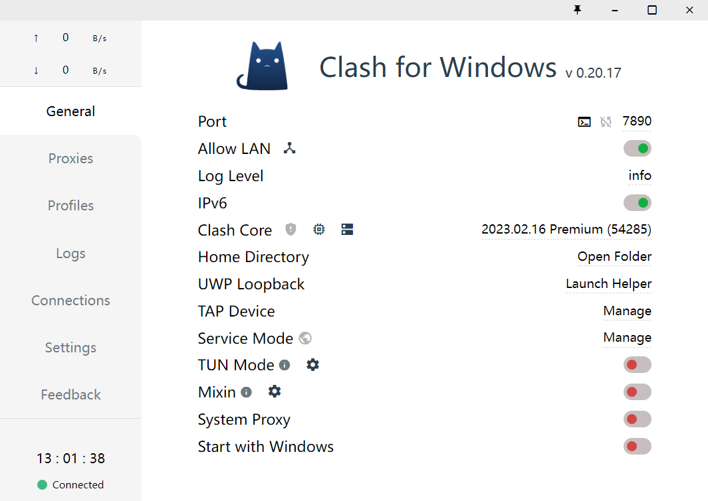
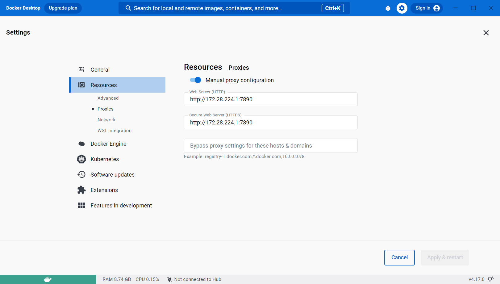

## 背景
Docker是一个开放源代码的开放平台软件。Docker将操作系统虚拟化，让开发者可以更方便地在不同操作系统的机器开发，大大减少了配环境工作的繁杂性，降低了配错环境后无法恢复的风险。

但Docker镜像在国内需要流量走代理才能访问。

## 环境
* Windows操作系统。
* 已安装Docker Desktop。
* 已有本地运行的代理（本文以Clash为例）。

## 查看WSL网卡的IP地址
打开终端，输入命令`ipconfig`：

找到形如下面的一项输出：
```
以太网适配器 vEthernet (WSL):

   连接特定的 DNS 后缀 . . . . . . . :
   本地链接 IPv6 地址. . . . . . . . : ipv6-address
   IPv4 地址 . . . . . . . . . . . . : ipv4-address
   子网掩码  . . . . . . . . . . . . : mask-code
   默认网关. . . . . . . . . . . . . :
```
记下ipv4 address，后续步骤需要使用。

## 配置Clash
打开Clash。点击左侧General。查看Port一栏的值，记下port。

打开Allow LAN选项。（因为Docker和Clash处于同一局域网）


## 配置Docker
打开Docker Desktop。点击右上角的设置图标->Resources->Proxy，填写本机Clash代理的链接。

链接格式为http://ipv4-address:port。



## 测试
打开终端，运行`docker pull <some images>`命令即可。

## 参考文献
https://exp-blog.com/container/windows-xi-tong-she-zhi-docker-dai-li-zhi-yin/