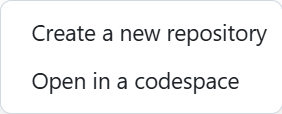
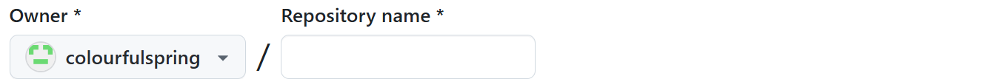
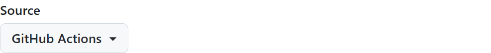

# 使用需求
以网页形式搭建个人博客，既能记录学习到的知识和技术，方便随时阅读，也能和人交流。

经过调研，列出博客功能需求：
1. 使用支持博客编写、编译、部署三个步骤分离的静态网页生成器作为构建工具。
2. 能显示 Markdown 、LaTeX 公式、图像等基本网页元素。
3. 支持字数统计、阅读时间、浏览量统计功能。
4. 支持评论区功能。
5. 支持分类和标签功能，方便进行博客归档。
6. 支持文章置顶功能。

# 工具选择
经过调研，得知主流的静态网页生成方案主要有：
* Jekyll。一个简单的静态网站生成器，用于生成个人，项目或组织的网站，被 Github 官方采用。
* Hexo。由 Node.js 驱动的博客框架。优势是主题生态比较丰富。
* Hugo。由 Go 驱动的博客框架。优势是编译速度较快，缺点是主题丰富程度不如 Hexo。

根据使用需求 2~5 挑选主题，选中[ Next 主题](https://theme-next.js.org/)。该主题原版本支持 Hexo 框架，后续由其他开源社区贡献者支持 Hugo 框架。因此选择 Hugo 框架和 Hugo 版本的 NexT 主题是较优的一种路线。

# 本机环境配置
构建博客需要在本机完成博客 Markdown 源码的编写，网页编译和部署测试。需要安装 Git 分布式版本控制工具， Go 运行环境和 Hugo 框架。

详细安装流程见[此链接](https://gohugo.io/installation)。本文不再赘述。

在终端输入命令`hugo version`，若显示形如下文的版本号，则说明 Hugo 安装成功。
```text
hugo v0.139.0+extended windows/amd64 BuildDate=unknown
```

# 使用 Github Pages 部署 NexT 主题博客 
## 创建新仓库
Hugo NexT 主题提供了一个方便使用者快速启动的主题仓库模板。下面将使用该模板创建个人博客站点并使用 Github Pages 直接托管。详细步骤可查看[官方教程](https://pages.github.com/)

进入 NexT 仓库[模板](https://github.com/hugo-next/hugo-theme-next-starter)，单击右上角的绿色`Use Template`。若读者希望使用其他主题，可以去寻找该主题的 `starter` 仓库，如下步骤仍适用。


在弹出的菜单中选择第一项 `Create a new repository`。



按照 [Github Pages 教程](https://pages.github.com/)，我们需要填入 `Repository name` 为 *username*.github.io，其中 *username* 是你的 Github 用户名。



其他配置不变。单击`Create Repository`即可完成新仓库创建。


## 配置仓库使用 custom Github Actions 实现自动构建和部署博客
根据[官方文档](https://docs.github.com/en/actions/about-github-actions/understanding-github-actions)介绍，Github Actions 能将构建、部署、测试流程自动化。我们只需将 Markdown 编写的博客源码提交到上一步创建的仓库，将由 Github 自动完成剩余工作。我们可直接访问构建后的博客网页。

Github Pages 默认使用 Jekyll 构建提交的网页源码，因此我们需要修改 *username*.github.io 的默认设置为 `Github Actions`，告诉 Github 使用 custom `Github Actions` 构建网页。根据[官方文档](https://docs.github.com/en/pages/getting-started-with-github-pages/configuring-a-publishing-source-for-your-github-pages-site#publishing-with-a-custom-github-actions-workflow)所言，将 `Build and deployment` 的 `Source` 选项修改为 `Github Actions`。



## 下载主题文件
我们使用该命令将仓库 clone 到本机。（修改 username 为你的用户名）

```bash
git clone git@github.com:username/username.github.io.git
```

进入 `*username*.github.io` 目录，使用该命令下载 NexT 主题相关文件到本机。

```bash
git submodule add https://github.com/hugo-next/hugo-theme-next.git themes/hugo-theme-next
```

## 配置 *username*.github.io 仓库的 custom `Github Actions` 内容
进入 `*username*.github.io/.github/workflows` 目录，删除该目录下其他文件，新建 `hugo.yaml` 文件。

```bash
cd username.github.io/.github/workflows
rm *
touch hugo.yaml
```

打开[Hugo 官方文档](https://gohugo.io/hosting-and-deployment/hosting-on-github/)，找到 `Step 6` 下的 `hugo.yaml` 文件内容，复制到刚才创建的 `hugo.yaml` 文件中。

## 提交仓库内容到 Github 并构建部署
按照 `Step 7`， 使用 `Git` 运行如下命令，将修改后的配置提交到 Github。

```bash
git add -A
git commit -m "Create hugo.yaml"
git push
```

按 `Step 8 ~ 10` 检查构建、部署进度，完成后可访问 `https://username.github.io` 查看博客。

# 编辑博客内容
删除 `content/post` 目录下的旧有博客内容。
```bash
rm -r content/post
```
通过安装在本机的 Hugo 框架，新建一篇主题为 `hello-world` 的博客。
```bash
hugo new content post/hello-world/index.md
```

查看 `post/hello-world/index.md` 文件，内容如下：
```text
---
title: "Hello world"
description: "hello world"
keywords: "hello world"

date: 2024-12-21T15:39:59+08:00
lastmod: 2024-12-21T15:39:59+08:00

categories:
  -
tags:
  -
  -

# 原文作者
# Post's origin author name
#author:
# 原文链接
# Post's origin link URL
#link:
# 图片链接，用在open graph和twitter卡片上
# Image source link that will use in open graph and twitter card
#imgs:
# 在首页展开内容
# Expand content on the home page
#expand: true
# 外部链接地址，访问时直接跳转
# It's means that will redirecting to external links
#extlink:
# 在当前页面关闭评论功能
# Disabled comment plugins in this post
#comment:
#  enable: false
# 关闭文章目录功能
# Disable table of content
#toc: false
# 绝对访问路径
# Absolute link for visit
#url: "aaa.html"
# 开启文章置顶，数字越小越靠前
# Sticky post set-top in home page and the smaller nubmer will more forward.
#weight: 1
# 开启数学公式渲染，可选值： mathjax, katex
# Support Math Formulas render, options: mathjax, katex
#math: mathjax
# 开启各种图渲染，如流程图、时序图、类图等
# Enable chart render, such as: flow, sequence, classes etc
#mermaid: true
---

hello world

<!--more-->

```

其中博客内容使用 Markdown 填写在 `<!--more-->` 处，其余 title, tag 等配置按需完成修改即可。

运行下列命令，可在本机测试博客效果。
```bash
hugo server
```

使用 Git 将博客推送到 Github 平台。
```bash
git add content
git commit -a -m "your comments"
git push
```

访问 `https://github.com/username/username.github.io/actions` 即可查看博客部署情况。若出现绿色勾则表示博客部署完成。最后访问 `https://username.github.io` 可查看博客内容。

# 在博客中插入图片
进入上一节创建的目录 `hello-world` ，新建目录 `img`。将需要插入博客的图片移动到 `img\image.jpg` 处。最后在 `index.md` 中引用图片即可。
```markdown

```
> 本节内容参考[1](https://wrong.wang/blog/20190301-%E6%9C%AC%E7%AB%99%E5%BC%95%E7%94%A8%E5%9B%BE%E7%89%87%E7%9A%84%E9%A1%BA%E6%BB%91%E6%B5%81%E7%A8%8B/), [2](https://www.yuweihung.com/posts/2021/hugo-blog-picture/) 两篇博客。

# 开启打赏功能
如果想在博客中添加微信和支付宝的打赏二维码，可以按照以下步骤操作：

1. 首先准备好微信和支付宝的收款二维码图片
2. 将这些图片放在 `static/images/` 目录下（如果目录不存在则创建）
3. 修改 `config/_default/params.yaml` 文件，找到 `reward` 部分并按如下配置：

```yaml
reward:
  enable: true
  comment: 觉得文章不错就请博主喝杯咖啡吧～
  ways:
    # - name: 支付宝
    #   path: /images/alipay.png
    - name: 微信
      path: /images/wechat.png
```

其中 `path` 是二维码图片相对于 `static` 目录的路径。可以根据需要启用或禁用不同的支付方式。

完成配置后，每篇文章底部都会显示打赏按钮。访客点击后即可看到配置的收款二维码。

# Todo
* 修改在线编辑功能，postEdit: url: 属性
* 修改 ContentStartLevel
* 首页展示博客需要展示一部分??

<!--more-->
